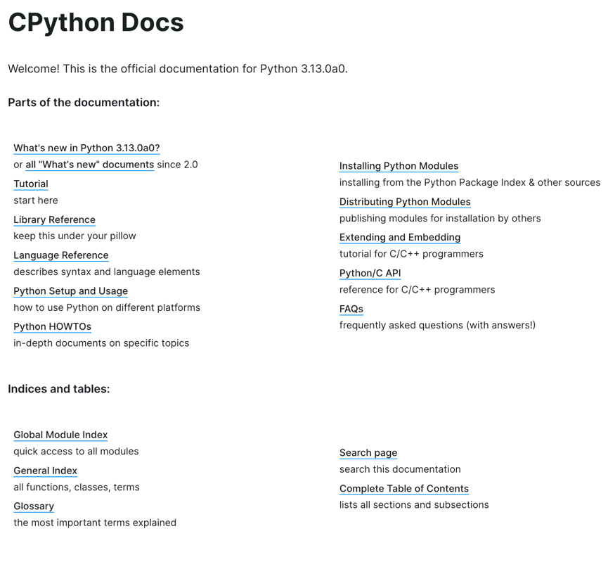
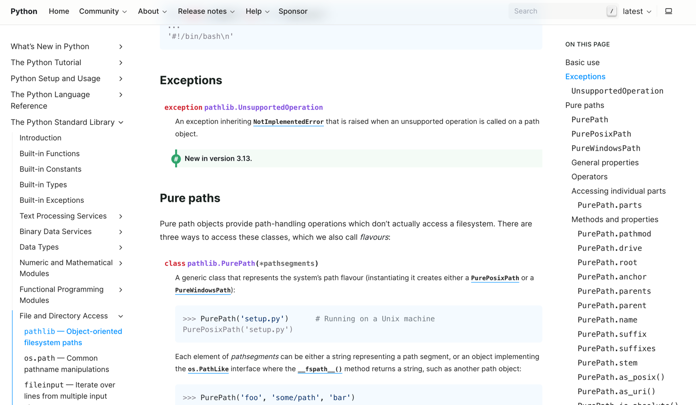

CPython as of 3.13.0a0, using the Shibuya theme
================================================

`Shibuya Theme <https://shibuya.lepture.com/>`_ is a modern theme for Sphinx.

It's hot!

Build
-----

.. code-block:: console
    :caption: Install, build, and serve docs

    cd Doc/
    make docs-install
    make docs-serve

Visit http://localhost:8000/ to view the documentation.
